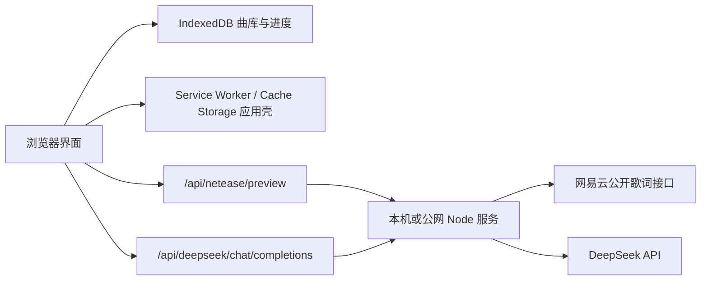

# ANISON

[](https://github.com/riiiveeer/ANISON/actions/workflows/ci.yml)

ANISON 是一款面向日语歌曲歌词的本地优先学习工具。你可以导入 LRC 或网易云公开单曲歌词，在单卡和连读两种模式中熟悉歌词，并通过次日复习巩固真正需要学习的日语句子。

> 当前状态：`1.0.0-beta.3` 朋友测试版。生产 PWA 与 Render Blueprint 已完成本地施工；固定 HTTPS 服务、真实手机和回滚验收仍须完成后才会公布为可用 Beta。更新前仍建议先在设置页导出完整备份。

## 主要功能

- 网易云公开单曲链接、分享文本和歌曲 ID 导入
- 本地单个/批量 `.lrc` 文件与粘贴歌词导入
- 原文、中文翻译、罗马音时间轴对齐
- 单卡专注学习与上下滚动连读
- AI 歌词讲解、缓存、追问和重试
- 本地曲库、封面、搜索、编辑和删除
- 学习进度、收藏、次日复习和三档复习反馈
- 纯英文歌词不占日语进度；相同日语歌词只学习和复习一次
- IndexedDB v3 规范化本地存储，以及带进度、取消和自动回滚的完整数据导出/恢复
- 可安装 PWA、离线本地学习、版本展示和不会打断数据操作的安全更新
- 同一 WiFi 下的手机访问

## 三分钟开始

环境要求：Node.js 24 LTS、npm、支持 IndexedDB 的现代浏览器。

```bash
git clone https://github.com/riiiveeer/ANISON.git
cd ANISON
npm ci
npm run dev
```

打开终端显示的 `Local` 地址。Windows 用户安装依赖后也可以双击 `启动ANISON.cmd`。

### 同一 WiFi 手机访问

```bash
npm run dev:lan
```

手机和电脑连接同一 WiFi，在手机浏览器打开终端显示的 `Network` 地址，例如 `http://192.168.1.20:3000`。如果连接失败，请确认 Windows 防火墙已允许 Node.js 访问“专用网络”。

完整的朋友测试步骤与反馈模板见 [测试指南](docs/testing-guide.md)。

### 安装与离线使用

PWA 只在生产构建中启用。桌面本机可执行：

```bash
npm run build
npm start
```

在 `http://localhost:3000` 打开一次并等待 Service Worker 激活后，可从设置页安装、检查更新，并在断网时继续浏览曲库、学习、复习、评分和导出备份。手机安装要求 HTTPS；局域网的普通 HTTP 地址可用于页面联调，但不作为 PWA 安装环境。

网易云解析和新的 AI 请求不会离线执行。新版本准备好后会显示“立即更新/稍后”，导入、编辑或备份恢复期间不会刷新页面。

## 学习规则

- 第一次看完 AI 讲解并切换到下一张后，该日语学习单元记为已学，安排次日复习。
- 纯英文段落仍出现在完整歌词中，但不要求 AI 讲解，也不计入日语进度或复习。
- 规范化后相同且翻译相同的日语句子共用 AI 讲解、学习状态和复习计划。
- 次日复习选择“忘记”或“模糊”时，七天后再次复习；选择“掌握”后不再安排。

## 运行方式

| 命令 | 用途 | 可访问范围 |
| --- | --- | --- |
| `npm run dev` | 本机开发和测试 | 当前电脑 |
| `npm run dev:lan` | 手机联调 | 同一局域网 |
| `npm run build` | 生成生产静态资源 | 输出到 `dist` |
| `npm start` | 启动构建后的生产 Node 服务 | 当前电脑及局域网 |
| `npm run preview:lan` | 在局域网预览构建结果 | 同一局域网 |
| `npm test` | 运行自动测试 | 本机/CI |
| `npm run test:e2e` | 运行 Chromium 核心业务闭环 | 本机/CI |
| `npm run test:pwa` | 使用生产 Node 服务验证离线与更新 | 本机/CI |
| `npm run test:perf` | 运行 1,000 首/80,000 卡性能门禁 | 本机/CI |
| `npm run check` | 测试、构建和高危依赖审计 | 本机/CI 前检查 |

Windows Chromium 的磁盘型 IndexedDB 吞吐波动较大，本机性能任务会跳过“完整迁移 30 秒”这一项；该硬门禁在 Linux CI 中执行，其余 80,000 卡页面指标仍会在本机执行。

## 架构与数据流



歌曲、歌词和学习进度默认只保存在访问者当前浏览器的 IndexedDB 中。电脑与手机即使访问同一个地址，数据也不会自动同步。

## GitHub Pages 与完整网页版

`dist` 只包含静态资源。GitHub Pages 可以展示前端，但不能运行本项目的 Node 中间件，因此网易云链接导入和 AI 讲解都不可用。

完整公网版本需要：

1. 能持续运行 Node.js 的服务；
2. HTTPS 和域名；
3. 已内置的网易云与 DeepSeek 接口限流、日志脱敏，以及部署平台的故障监控；
4. 与 IndexedDB 数据版本兼容的更新策略。

仓库根目录的 `render.yaml` 描述 Singapore Free Node Web Service，并要求 GitHub CI 通过后才自动部署。部署完成后可运行只读冒烟：

```bash
npm run verify:deployment -- https://<service>.onrender.com
```

未提供 Beta 凭据时会验证公开 `/healthz` 和未认证 401；通过环境变量提供成对凭据后会继续验证 PWA 资源、缓存、MIME、安全头、版本/提交/BUILD_ID 和未知 API。部署差异、环境变量与回滚步骤见 [部署与更新方案](docs/deployment.md)。

## 隐私与安全

- DeepSeek Key 只应填写在应用设置页，不要写入源码、Issue、截图或日志。
- AI 讲解会把当前歌词、翻译、罗马音及必要上下文发送给 DeepSeek。
- 用户 Key 会经过当前 ANISON Node 服务，但服务不会保存、缓存或写入日志；AI 讲解缓存只保存在浏览器本地。
- 网易云导入仅处理公开单曲，不读取用户账号 Cookie，也不绕过会员权限。
- 导入歌词的获取、保存和使用应由测试者自行确认符合相关版权与平台规则。

详细信息见 [隐私说明](PRIVACY.md) 和 [安全策略](SECURITY.md)。

## 开发与验证

```bash
npm ci
npm run check
```

每次推送到 `main` 或创建 Pull Request 时，GitHub Actions 会自动安装依赖，运行单元、IndexedDB 集成、Chromium 核心 E2E、独立生产 PWA E2E 和大数据性能测试，构建生产资源并执行高危依赖审计。

项目结构：

```text
src/app       路由和启动编排
src/db        IndexedDB 仓储
src/engine    LRC、导入、AI 和复习逻辑
src/render    各页面视图
src/pwa       安装、网络、更新和 Service Worker 生命周期
src/store     业务状态与数据备份
server        生产服务器、共享 API 中间件与安全门禁
shared        前后端共用的 API 配置
tests         自动测试和原创测试夹具
```

贡献前请阅读 [CONTRIBUTING.md](CONTRIBUTING.md)。当前路线和历史改造记录见 [docs/roadmap.md](docs/roadmap.md)。

## 已知限制

- 网易云兼容接口不是公开稳定 API，可能因上游变化临时失效。
- 不支持网易云登录、会员权限绕过、歌单/专辑批量导入或音频下载。
- 电脑与手机之间暂不自动同步曲库。
- Android/iPhone 的真实安装、刘海屏、软键盘和离线冷启动验收仍等待阶段 D 固定 HTTPS 服务。
- 当前仓库只具备可复现的 Render 部署配置，尚未记录已验收的正式公网服务，也没有上架 Android 或 iOS；安装 PWA 不会把其他域名或 localhost 的数据迁移过来。

## 许可证

ANISON 使用 [Apache License 2.0](LICENSE)。你可以在遵守许可证和 [NOTICE](NOTICE) 归属要求的前提下使用、修改和分发本项目。

网易云歌词导入的协议流程和时间轴对齐思路参考了 [jitwxs/163MusicLyrics](https://github.com/jitwxs/163MusicLyrics)。详细归属说明见 [网易云导入文档](docs/netease-import.md)。
