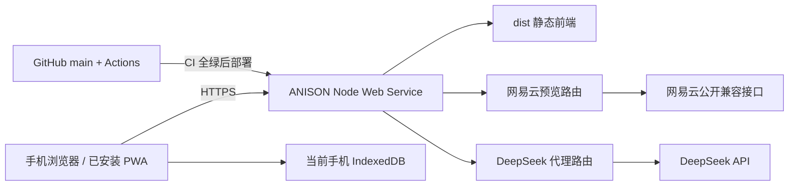

# ANISON 公网 Node 网页版与手机 PWA 施工方案

## 1. 文档定位

本文用于把 ANISON 从“需要在电脑上运行 Vite、手机通过同一 WiFi 访问”的局域网工具，升级为“朋友可通过固定 HTTPS 地址直接使用，并可安装到手机桌面”的公网测试版。

本轮目标是公开 Beta，不是账号制正式商业服务。优先保证部署简单、数据不丢、接口不被滥用，并保留以后迁移平台和封装 App 的空间。

## 2. 目标与验收标准

完成后必须满足：

- 用户只需打开一个 HTTPS 地址，不需要安装 Node.js，也不依赖开发者电脑开机。
- Android 与 iPhone 可将 ANISON 添加到桌面，并以独立窗口启动。
- 首页、曲库、学习、复习、设置、数据导出恢复在手机端正常工作。
- 网易云公开单曲导入与 DeepSeek AI 讲解可通过同源 Node 接口使用。
- DeepSeek Key 不写入源码、构建产物、服务器日志或 GitHub Secrets。
- 手机刷新、关闭浏览器或安装 PWA 后，IndexedDB 学习数据仍然保留。
- 部署新版本时不主动清空浏览器数据，并能提示用户刷新到新版。
- GitHub CI 未通过时不得自动部署生产版本。
- 生产服务具备健康检查、限流、超时、请求体限制、安全响应头和脱敏日志。
- 核心移动端 E2E、生产服务器集成测试、构建和依赖审计全部通过。

建议的 Beta 服务指标：

- 服务温启动后的首页响应 P95 小于 1 秒。
- 移动端暖缓存首屏可交互时间目标小于 3 秒。
- `/healthz` 响应时间小于 500 毫秒。
- 网易云接口整体超时维持在 15 秒以内。
- DeepSeek 接口整体超时设置为 45 秒。
- 发布失败时保留上一可用版本，不覆盖线上服务。

## 3. 本轮明确不做

- 用户账号、云端曲库或跨设备自动同步。
- 把开发者自己的 DeepSeek Key 提供给所有用户。
- 网易云登录、Cookie、会员权限绕过、音频下载或歌单批量导入。
- Android/iOS 原生安装包和应用商店上架。
- 复杂后台管理系统、付费系统或公开多租户数据库。
- 承诺完全离线使用 AI 和网易云导入。

## 4. 当前基线与主要差距

### 4.1 已有基础

- Vite 单页应用和 Hash 路由。
- IndexedDB 本地曲库、学习记录、复习记录和数据备份。
- `/api/netease/preview` 网易云本地网关。
- `/api/deepseek/chat/completions` 的 Vite/Express 共用受限代理。
- 基础 manifest 和 Service Worker 注册入口。
- GitHub Actions 单元测试、构建、浏览器 E2E 和性能门禁。
- Apache-2.0、隐私说明、安全策略和公开 Issue 模板。

### 4.2 阻塞公网部署的问题

1. 阶段 A 已完成：`npm start` 现在启动正式 Express 生产服务器，并提供静态资源和健康检查。
2. 阶段 B 已完成：两条 API 共用 Vite/Express 中间件，并具备公网限流、代理 IP、统一日志和安全门禁。
3. manifest 仍缺少 192、512 和 maskable 图标。
4. Service Worker 只有安装壳，没有离线缓存和版本更新流程。
5. 从 `localhost` 切换到公网域名后，浏览器会使用新的存储源，本机数据不会自动出现在线上域名。

## 5. 目标架构



采用单一同源服务：同一个域名同时提供前端、网易云接口和 DeepSeek 接口。这样不需要开放 CORS，也能减少手机端配置和跨域失败。

## 6. 技术选型

### 6.1 生产服务

首版采用 Express 5：

- `express`：路由、静态文件和中间件编排。
- `helmet`：安全响应头。
- `compression`：文本资源压缩。
- `express-rate-limit`：单实例 Beta 的 IP 频率限制。

继续复用现有 Node 20+ 原生 `fetch`、网易云 Service 和 Vite 中间件中的验证逻辑。不要把网易云实现复制成第二套。

### 6.2 运行时

生产、CI 和开发基线统一升级到 Node.js 24 LTS：

- `package.json` 的 `engines.node` 调整为 `>=24 <25`。
- 新增 `.node-version`，内容固定为当前验证过的 Node 24 LTS 小版本。
- GitHub Actions 从 Node 20 切换至 Node 24。
- 本机 Windows 启动说明同步更新。

不使用 Node.js 26 Current 作为生产基线，等其进入 LTS 并完成兼容测试后再升级。

### 6.3 首选部署平台

首轮朋友测试推荐 Render Web Service：

- 能直接连接当前 GitHub 仓库。
- 支持 Node Web Service、自动 HTTPS、健康检查和自定义域名。
- 可以设置为 GitHub CI 检查通过后再部署。
- 免费实例适合早期测试，但闲置 15 分钟后会休眠，首次唤醒可能约一分钟。

需要稳定日常使用时，可迁移到 Railway Hobby。Railway 提供公网域名、自动 SSL 和按量计费，当前 Hobby 基础费用为每月 5 美元。

GitHub Pages 只作为纯静态演示备选，不承担完整 ANISON 服务。

## 7. 目录与文件改造

建议新增或修改：

```text
server/
  index.js                         # 正式生产入口
  app.js                           # Express app 工厂，便于测试
  middleware/
    security.js                    # Helmet、来源校验和响应头
    beta-auth.js                   # 可选朋友测试访问门禁
  http/
    common.js                      # JSON、错误、同源、requestId、日志和限流
  deepseek/
    middleware.js                  # DeepSeek 生产代理
    vite-plugin.js                 # Vite 适配
  netease/
    client.js
    input.js
    service.js
    vite-plugin.js                 # 只保留 Vite 适配
    middleware.js                  # 可被 Express/Vite 共同复用
  static/
    serve-app.js                   # dist 缓存策略和入口文件
public/
  icons/
    icon-192.png
    icon-512.png
    icon-maskable-512.png
    apple-touch-icon.png
  manifest.webmanifest
  sw.js
src/app/
  app-version.js                   # 版本读取与更新提示
  bootstrap.js
tests/
  production-server.test.js
  deepseek-middleware.test.js
  pwa-assets.test.js
e2e/
  public-web.spec.js
.node-version
render.yaml
```

## 8. 生产 Node 服务器

### 8.1 启动方式

修改脚本：

```json
{
  "scripts": {
    "dev": "vite",
    "dev:lan": "vite --host 0.0.0.0",
    "build": "vite build",
    "start": "node server/index.js",
    "start:local": "node server/index.js"
  }
}
```

`server/index.js` 只负责读取环境变量和监听端口：

- Host：`0.0.0.0`
- Port：`Number(process.env.PORT) || 3000`
- 启动失败必须输出错误码并以非零状态退出。
- 收到 `SIGTERM` 时停止接收新请求，并在限定时间内优雅退出。

`server/app.js` 导出 `createApp(options)`，测试时可以注入假的网易云客户端、假的 DeepSeek fetch 和时钟。

### 8.2 路由顺序

1. 请求上下文和 requestId。
2. `trust proxy = 1`，正确读取 Render/Railway 转发后的客户端 IP。
3. Compression 和安全响应头。
4. 可选 Beta 访问门禁。
5. `/healthz`。
6. `/api/netease/preview`。
7. `/api/deepseek/chat/completions`。
8. `dist/assets` 等静态资源。
9. `/`、`/index.html`、manifest 和 Service Worker。
10. 统一 404 和错误处理。

由于应用使用 Hash 路由，服务器通常只接收到 `/`，不需要把任意未知 API 路径回退到 `index.html`。禁止 `/api/*` 被 SPA 回退掩盖。

### 8.3 健康检查

新增：

```http
GET /healthz
```

响应：

```json
{
  "ok": true,
  "version": "1.0.0-beta.x",
  "commit": "<部署提交 SHA>"
}
```

健康检查只判断进程与基础服务可用，不实时请求网易云或 DeepSeek，避免上游波动导致平台误重启。

## 9. 网易云生产接口

保留现有接口：

```http
POST /api/netease/preview
Content-Type: application/json
```

施工要求：

- 将 `createPreviewMiddleware` 中与 Vite 无关的逻辑移到 `server/netease/middleware.js`。
- Vite 插件和 Express 同时调用同一中间件或同一 handler。
- 保留输入最大 4096 字符、域名白名单、短链逐跳校验、上游响应限制和整体 15 秒超时。
- 保留全局并发 2、成功缓存 24 小时、无歌词短缓存和最多一次安全重试。
- 新增公网 IP 级限制：建议每 IP 每 10 分钟最多 20 次预览请求。
- 超过服务并发上限返回 `503 UPSTREAM_BUSY`，并带 `Retry-After`。
- 不在日志中记录完整分享文本、原始歌词、翻译或罗马音。
- 服务重启后内存缓存丢失是可接受的；Beta 阶段不引入 Redis。

## 10. DeepSeek 生产代理

保留浏览器使用者自带 Key 的模式，服务器只进行透明、受限转发。

接口：

```http
POST /api/deepseek/chat/completions
Authorization: Bearer <用户自己的 Key>
Content-Type: application/json
```

必须实施：

- 只允许 `deepseek-v4-flash` 和 `deepseek-v4-pro`。
- 请求体上限建议 64 KB。
- 只接受当前应用需要的 `messages`、`thinking`、`temperature` 和 `max_tokens` 字段。
- `max_tokens` 上限固定为 800；服务端不能完全信任客户端值。
- 45 秒整体超时，浏览器取消时同步取消上游请求。
- 每 IP 每 10 分钟建议最多 60 次请求。
- 不记录 Authorization、Prompt、歌词上下文或 AI 完整响应。
- 上游错误转换为当前统一中文错误格式；不要把未知内部错误堆栈返回浏览器。
- 不允许把开发者共享 Key 写入环境变量后供所有匿名用户调用，避免费用失控。
- 响应头使用 `Cache-Control: no-store`。

Beta 服务的 Node 进程会接触到请求头中的用户 Key，因此隐私说明必须明确这一点；HTTPS 只能保护传输过程，不能让服务端“看不到”Key。

## 11. 公网安全基线

### 11.1 请求与来源

- 仅接受同源浏览器请求。
- 检查 `Origin`；无 Origin 的健康检查和同站导航按路由单独处理。
- 生产环境不返回通配 `Access-Control-Allow-Origin`。
- API 只允许所需 HTTP 方法，其他方法返回 405。
- JSON 解析错误返回固定 400，不泄露堆栈。
- 设置全局请求体上限，并对两个 API 使用更严格上限。

### 11.2 响应头

至少包含：

- `X-Content-Type-Options: nosniff`
- `Referrer-Policy: strict-origin-when-cross-origin`
- `Permissions-Policy` 禁止未使用的相机、麦克风和定位权限
- `Strict-Transport-Security`，仅在 HTTPS 生产域名启用
- `Content-Security-Policy`

CSP 先使用 Report-Only 在测试环境观察，再切换强制模式。必须确认封面图片 CDN、DeepSeek/网易云均只经过服务端，不需要前端放开任意 `connect-src`。

### 11.3 Beta 访问门禁

朋友测试初期建议支持可选环境变量：

- `BETA_AUTH_USERNAME`
- `BETA_AUTH_PASSWORD`

两个变量都存在时启用门禁，`/healthz` 保持不鉴权。首次访问使用 HTTP Basic，验证后换取 12 小时 HttpOnly、SameSite=Strict 会话 Cookie，使 DeepSeek 可继续使用 Bearer Authorization。凭据只放部署平台 Secret，不写入仓库；只配置一个变量时服务拒绝启动。准备公开邀请测试后可移除门禁，仅保留限流。

### 11.4 日志

每条请求只记录：

```json
{
  "requestId": "...",
  "method": "POST",
  "path": "/api/netease/preview",
  "status": 200,
  "durationMs": 240,
  "errorCode": ""
}
```

禁止记录：

- DeepSeek Key 或 Authorization。
- 完整网易云分享文本。
- 歌词、翻译、罗马音和 AI Prompt。
- IndexedDB 导出文件内容。
- 未经不可逆处理的完整客户端 IP。

## 12. 静态资源与缓存

生产服务器缓存策略：

| 资源 | Cache-Control |
| --- | --- |
| `assets/*` 带哈希文件 | `public, max-age=31536000, immutable` |
| `index.html` | `no-cache` |
| `manifest.webmanifest` | `no-cache` |
| `sw.js` | `no-cache` |
| `/api/*` | `no-store` |

静态文件服务必须防止路径穿越，只允许读取 `dist` 与明确的公开文件。生产错误响应不得暴露绝对文件路径。

## 13. 手机 PWA 完善

### 13.1 Manifest

补充并验证：

- 稳定的 `id`。
- `name`、`short_name`、`start_url`、`scope`。
- `display: standalone`。
- `theme_color`、`background_color`。
- 192×192 PNG 图标。
- 512×512 PNG 图标。
- 512×512 maskable 图标。
- Apple Touch Icon。
- `prefer_related_applications: false`。

### 13.2 Service Worker 缓存策略

- `index.html`：Network First，失败时使用最后缓存入口。
- 带哈希的 JS/CSS：Cache First。
- 本地占位图和图标：Cache First。
- `/api/netease/*`：Network Only。
- `/api/deepseek/*`：Network Only，绝不缓存 Authorization 或 AI 响应。
- 第三方封面：先保持浏览器普通缓存，不主动写入 Service Worker Cache。

安装新 Service Worker 后清理旧版本缓存；缓存名称包含应用版本。

### 13.3 更新体验

1. 启动后检查 Service Worker 更新。
2. 检测到 waiting worker 时显示“发现新版本”。
3. 用户点击“立即更新”后向 worker 发送 `SKIP_WAITING`。
4. `controllerchange` 后只刷新一次页面。
5. 用户正在编辑或导入恢复时不强制刷新。
6. 设置页显示当前版本和“检查更新”。

### 13.4 离线边界

离线时应允许：

- 打开应用壳。
- 浏览已存曲库。
- 单卡和连读学习。
- 写入学习进度和复习评分。
- 导出本地数据。

离线时明确禁用并说明：

- 网易云链接解析。
- AI 讲解和追问。
- 在线封面首次加载。

## 14. 数据与域名迁移

IndexedDB 按 Origin 隔离。以下地址的数据彼此独立：

- `http://localhost:3000`
- `http://192.168.x.x:3000`
- `https://anison.onrender.com`
- 未来自定义域名

因此上线前必须：

1. 在旧地址设置页导出完整备份。
2. 打开新的 HTTPS 地址。
3. 导入备份并预览覆盖范围。
4. 核对歌曲数、学习单元数、收藏数和待复习数。

如果准备购买自定义域名，应尽早确定并让朋友主要在该域名积累数据，避免之后再次迁移 Origin。

本轮不增加云端同步；网页服务不保存用户曲库。

## 15. Render 部署配置

根目录 `render.yaml` 是阶段 D 的可审计部署契约：

```yaml
services:
  - type: web
    name: anison-web
    runtime: node
    plan: free
    region: singapore
    branch: main
    buildCommand: npm ci && npm run build
    startCommand: npm start
    healthCheckPath: /healthz
    autoDeployTrigger: checksPass
    maxShutdownDelaySeconds: 15
    renderSubdomainPolicy: enabled
    envVars:
      - key: NODE_ENV
        value: production
      - key: CSP_MODE
        value: report-only
      - key: BETA_AUTH_USERNAME
        sync: false
      - key: BETA_AUTH_PASSWORD
        sync: false
```

Node 精确版本由根目录 `.node-version` 固定为 `24.14.1`；不在 Dashboard 或 Blueprint 设置优先级更高的 `NODE_VERSION`。服务器优先读取 Render 提供的 `RENDER_GIT_COMMIT`，并让 `/healthz`、页面构建元数据和 `sw.js` 对应同一提交。Blueprint 契约测试禁止明文 Secret、`PORT`、数据库、磁盘、服务端 DeepSeek Key 和网易云 Cookie。

部署步骤：

1. Render 登录并连接 GitHub。
2. 创建 Web Service，选择 `riiiveeer/ANISON`。
3. 选择 `main` 分支。
4. 设置 Build Command：`npm ci && npm run build`。
5. 设置 Start Command：`npm start`。
6. 设置 Health Check：`/healthz`。
7. Auto Deploy 选择 `After CI Checks Pass`。
8. 设置 Beta 访问凭据。
9. 部署后生成 `onrender.com` 地址。
10. 在手机 WiFi 和移动网络各完成一次烟雾测试。

免费服务冷启动属于已知限制。若朋友日常使用时频繁遇到一分钟等待，应升级实例或迁移 Railway，不要用定时探活规避平台休眠策略。

## 16. CI 与自动测试调整

### 16.1 Node 版本

- GitHub Actions 改为 Node 24。
- 本地和 CI 使用同一主版本。
- 增加 `npm run test:server`。

### 16.2 生产服务器集成测试

新增固定夹具测试：

- `/healthz` 返回版本与提交信息。
- `/` 返回 `index.html`。
- 哈希资源返回长期缓存头。
- `sw.js`、manifest 和 HTML 不使用长期强缓存。
- `/api/*` 不会回退到 HTML。
- 非法方法、非法 JSON、过大请求体返回固定错误。
- 伪造跨源 Origin 被拒绝。
- DeepSeek 请求不支持的模型被拒绝。
- DeepSeek Key 不出现在日志和错误信息中。
- 网易云和 DeepSeek 超时会取消上游请求。
- 频率限制返回 429 和 `Retry-After`。
- 生产错误不包含本机绝对路径和堆栈。

### 16.3 移动端 E2E

在现有 390×844 流程上增加：

- 从生产 Node 服务而不是 Vite dev server 启动。
- 首次打开后 manifest 和 Service Worker 注册成功。
- 安装条件检查包含 192/512 图标。
- 离线重新打开仍可进入曲库和学习已存歌曲。
- 离线时网易云与 AI 显示明确提示。
- 新 Service Worker 等待时出现更新按钮。
- 更新后 IndexedDB 数据未丢失。
- 导出本地域数据后能在干净浏览器上下文恢复。

网络测试继续使用固定夹具，常规 CI 不依赖真实网易云或 DeepSeek。

## 17. 分阶段施工顺序

### 阶段 A：生产服务底座

状态：已于 `1.0.0-beta.2` 工作区完成，并随阶段 B 完成生产集成验收。

交付：

- [x] Node 24 基线。
- [x] Express app 工厂和正式入口。
- [x] 静态文件、`/healthz`、优雅退出。
- [x] `npm start` 启动生产服务。

验收：生产构建后可通过一个端口访问首页和健康检查。

### 阶段 B：接口迁移与安全

状态：已在当前工作区完成；尚未执行 Render 公网部署。

交付：

- [x] 网易云共享 middleware，Vite 与 Express 使用同一实例逻辑。
- [x] DeepSeek 生产代理和前后端共用模型常量。
- [x] 限流、超时、Body 限制、严格同源/自定义头校验和固定错误结构。
- [x] requestId、无敏感内容的结构化日志、Helmet、Compression 和 CSP 双模式。
- [x] 可选 Beta Basic 换 12 小时会话 Cookie，`/healthz` 免鉴权。
- [x] 假上游单元/集成夹具，不在 CI 请求真实网易云或 DeepSeek。
- [x] 部署、隐私、安全和环境变量说明。

验收：Vite 开发与正式 Node 服务行为一致，接口测试全绿；生产构建后同一端口可提供首页、健康检查和两条受限 API。

本地验收记录（2026-08-14）：`npm test` 117/117 通过，`npm run build` 通过，Chromium 核心流程 1/1 通过，`npm audit --audit-level=high` 为 0 vulnerabilities；生产单端口浏览器冒烟通过首页、曲库和设置。全程使用假上游夹具，未请求真实网易云或 DeepSeek。

### 阶段 C：PWA 安装与离线

详细结构、缓存边界、施工步骤、测试矩阵、预期成果和回滚方案见 [阶段 C：PWA 安装、离线、更新与应用化施工方案](stage-c-pwa-appization-plan.md)。

状态：工程施工已于 `1.0.0-beta.3` 工作区完成；生产 Chromium 离线/更新 E2E 通过。Android 与 iPhone 实机安装验收等待阶段 D HTTPS 环境。

交付：

- [x] 完整图标和 manifest。
- [x] App Shell 离线缓存。
- [x] 更新提示与版本展示。
- [x] 离线功能提示。

验收：Android 和 iPhone 均可添加到桌面；断网后可学习已导入歌曲。

### 阶段 D：Render 部署

详细施工批次、Blueprint 契约、固定 HTTPS 验收、CSP 收口、实机矩阵和回滚演练见 [阶段 D：Render 固定 HTTPS 部署、发布门禁与回滚施工方案](stage-d-render-deployment-plan.md)。

状态：D0～D3 本地工程施工已完成，施工分支已推送并创建 PR #1；首次 Linux CI 暴露的大型恢复分页瓶颈已修复，等待三组 CI 复跑。`main` 必需检查和 Render 服务尚未配置。临时 Cloudflare Tunnel 仅作为阶段 C 预验收，固定 `onrender.com` Origin 的正式记录仍须在 D4～D8 完成。

交付：

- [x] `render.yaml` 与 Blueprint 秘密约束测试。
- [x] `npm run verify:deployment` 固定 HTTPS 只读冒烟。
- [ ] GitHub CI 通过后自动部署。
- [ ] HTTPS canonical Origin、健康检查和实机记录。
- [x] 部署、更新与回滚操作说明。

验收：不连接开发者电脑，朋友可通过公网手机完成核心流程。

### 阶段 E：朋友灰度测试

建议顺序：

1. 开发者自己在新域名完成全流程。
2. 2 名朋友使用 Beta 密码测试 2～3 天。
3. 扩大到 5～10 人，观察接口失败率和冷启动反馈。
4. 修复阻断问题后移除 Beta 门禁或进入下一 Beta 版本。

## 18. 发布门禁

每次生产部署前必须全部满足：

- [x] `npm ci` 通过。
- [x] 单元和集成测试通过。
- [x] 生产构建通过。
- [x] 浏览器核心 E2E 通过。
- [x] 1000 首 / 80000 卡性能门禁通过（Windows 跳过 Linux 专属完整迁移 30 秒项，其余预算通过；Linux CI 仍执行硬门禁）。
- [x] `npm audit --audit-level=high` 通过。
- [x] `/healthz` 通过。
- [x] 网易云固定夹具烟雾测试通过。
- [x] DeepSeek 假上游代理测试通过。
- [ ] 移动端 HTTPS 页面无 Mixed Content。
- [ ] 新版本读取旧 IndexedDB 和备份文件正常。
- [x] CHANGELOG、版本号和应用内显示一致。

## 19. 监控与运维

Beta 阶段至少观察：

- 服务启动失败次数。
- `/healthz` 可用性。
- HTTP 4xx、429 和 5xx 数量。
- 网易云错误码分布和上游超时率。
- DeepSeek 401、429、5xx 和超时率。
- 请求耗时分布。
- Render 冷启动相关反馈。

日志保留遵循最小化原则。若后续接入 Sentry 或其他平台，禁止上传歌词、Prompt、Key、备份内容和完整 URL 分享文本。

## 20. 回滚方案

### 20.1 服务回滚

1. 在 Render 选择上一成功部署。
2. 回滚后验证 `/healthz`、首页和两个 API 的固定夹具。
3. 暂停 Auto Deploy，避免故障提交再次覆盖。
4. 在 GitHub 创建修复分支，不直接修改线上容器。

### 20.2 前端和 Service Worker 回滚

- 新旧版本使用不同缓存名称。
- 回滚版本的 Service Worker 必须能删除未知的新缓存。
- 不要在回滚中清空 IndexedDB。
- 如果新版本进行了数据库迁移，必须保证旧版可读取，或在发布前明确禁止直接回滚并准备向前修复。

### 20.3 上游接口故障

- 网易云失败时只关闭链接导入，不影响本地 LRC、曲库、学习和复习。
- DeepSeek 失败时保留已有缓存，学习浏览仍可继续。
- 必要时用环境开关临时禁用单个外部接口。

## 21. 风险清单

| 风险 | 影响 | 缓解方式 |
| --- | --- | --- |
| 网易云非公开兼容接口变化 | 导入失败 | 独立适配器、固定错误码、功能开关、LRC 兜底 |
| 匿名公网请求滥用 | 限流或封禁 | Beta 门禁、IP 限流、并发上限、缓存 |
| DeepSeek Key 经服务器转发 | 隐私担忧 | HTTPS、不记录、清晰隐私说明、用户自带 Key |
| Render Free 冷启动 | 首次打开慢 | 测试期接受；稳定使用升级或迁移 Railway |
| 更换域名导致 IndexedDB 分离 | 用户以为数据丢失 | 上线前导出、固定域名、恢复引导 |
| Service Worker 缓存旧代码 | 用户无法及时更新 | 版本缓存、更新提示、`sw.js` no-cache |
| 中国大陆网络差异 | 页面或上游不稳定 | 分别用 WiFi/移动网络实测，必要时选择更合适区域或国内云 |
| 破坏性数据库迁移 | 学习记录受损 | schemaVersion、迁移测试、备份和回滚策略 |

## 22. 预计工作量

按当前代码基础估算：

| 工作包 | 预计时间 |
| --- | --- |
| Node 24 与正式服务器 | 0.5～1 天 |
| 网易云/DeepSeek 接口迁移和安全 | 1～1.5 天 |
| PWA 图标、离线和更新体验 | 1～1.5 天 |
| 测试、CI 和部署配置 | 1 天 |
| Render 上线与手机灰度验收 | 0.5～1 天 |

合计约 4～6 个有效开发日。若只做“朋友能打开网址”的最小版本，可先完成阶段 A、B、D，约 2～3 天；但不应把缺少限流和日志脱敏的 Vite 开发服务器直接暴露到公网。

## 23. 完成定义

只有同时满足以下条件，才能宣布“公网手机版 Beta 可用”：

- 固定 HTTPS 地址可访问。
- 开发者电脑关闭后服务仍可用。
- 朋友无需安装 Node.js。
- 手机可添加到桌面并独立窗口启动。
- 核心学习闭环和数据恢复通过真实设备验收。
- 网易云与 AI 接口有清晰失败状态，不拖垮本地主流程。
- 生产安全、CI、监控、版本更新和回滚路径均已验证。
- 文档明确本地数据、外部请求、无同步和 Beta 限制。

## 24. 官方参考

- [Render Web Services](https://render.com/docs/web-services)
- [Render 自动部署与 CI 门禁](https://render.com/docs/deploys)
- [Render 免费实例限制](https://render.com/docs/free)
- [Railway 公网域名与自动 HTTPS](https://docs.railway.com/networking/public-networking)
- [Railway 定价](https://docs.railway.com/pricing)
- [GitHub Pages 是静态托管](https://docs.github.com/en/pages/getting-started-with-github-pages/what-is-github-pages)
- [PWA 安装要求](https://developer.mozilla.org/en-US/docs/Web/Progressive_web_apps/Guides/Making_PWAs_installable)
- [PWA Web App Manifest](https://web.dev/learn/pwa/web-app-manifest)
- [PWA Service Worker](https://web.dev/learn/pwa/service-workers)
- [Node.js 受支持版本](https://nodejs.org/en/about/previous-releases)
