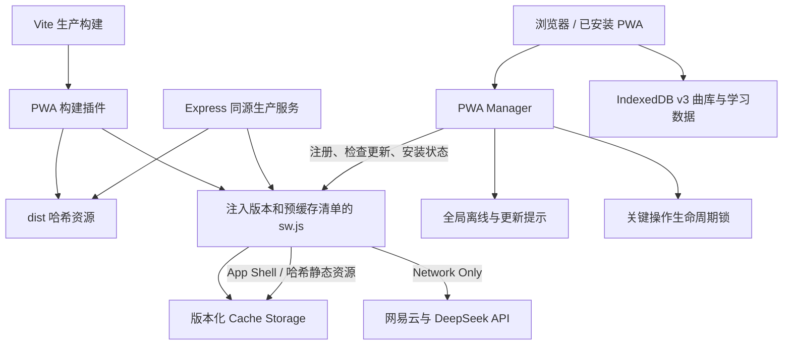
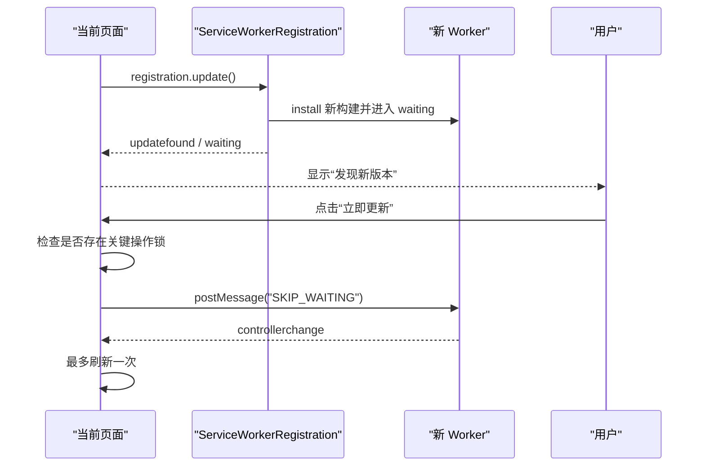

# ANISON 阶段 C：PWA 安装、离线、更新与应用化施工方案

## 1. 文档定位

本文是阶段 C 的直接施工说明，用于把已经完成生产服务与公网安全基线的 ANISON，推进为可以安装到手机桌面、在网络中断时继续学习、并能安全更新的 PWA 应用。

> 工程状态（2026-08-14）：C0～C7 已在 `1.0.0-beta.3` 工作区完成；C8 文档已收口。Android Chrome、iPhone Safari 和桌面安装的真实设备记录等待阶段 D 提供 HTTPS 地址后补齐。

阶段 C 完成后，ANISON 仍是同一套 Web 前端和 Node 服务，不生成 Android APK、iOS IPA，也不接入应用商店。它要先形成稳定的“应用内核”，为后续 Capacitor、TWA 或原生 WebView 外壳提供可靠基础。

前置条件：

- 阶段 A 已完成：Express 生产入口、静态资源、健康检查和优雅退出可用。
- 阶段 B 已完成：网易云与 DeepSeek 使用 Vite/Express 共用中间件，安全头、Beta 门禁、限流和脱敏日志可用。
- IndexedDB v3、数据备份恢复和核心学习流程已经有自动化测试。

## 2. 当前基线与差距

| 项目 | 当前状态 | 阶段 C 需要达到 |
| --- | --- | --- |
| Manifest | 已有名称、颜色和 standalone；`icons` 为空 | 身份、范围、图标和安装元数据完整 |
| Service Worker | 只有注册入口；安装时立即 `skipWaiting()` | 有版本化 App Shell、明确缓存边界和用户确认更新 |
| 离线能力 | 刷新依赖网络；在线功能失败提示不统一 | 已访问过的应用可离线启动并完成本地学习闭环 |
| 更新体验 | 没有 waiting worker 提示和版本展示 | 检测、提示、确认、切换、单次刷新完整闭环 |
| 网络状态 | 没有统一 online/offline 状态 | 全局提示；联网 API 明确降级；恢复在线后可重试 |
| 移动端壳层 | 已有移动优先布局和安全区基础 | standalone、刘海屏、软键盘和后台恢复经过验收 |
| PWA 测试 | Playwright 明确设置 `serviceWorkers: 'block'` | 生产服务下允许 SW，并覆盖离线、更新与数据不丢失 |
| 应用版本 | 仅 package 和 `/healthz` 有版本 | UI、构建资源、SW 缓存和部署版本可以相互定位 |

### 已确认的关键问题

1. 当前 `public/sw.js` 在 `install` 中直接调用 `skipWaiting()`，未来更新时可能让旧页面中途切换到新 worker；阶段 C 必须改为用户点击“立即更新”后才激活。
2. Vite 产物带内容哈希，手写静态预缓存列表容易漏掉新文件；预缓存清单必须由生产构建自动生成。
3. `navigator.onLine` 只能作为界面提示，不能证明网易云或 DeepSeek 一定可达；真实请求结果仍是最终依据。
4. 首次从未在线打开过的设备无法凭空获得离线资源；“离线可用”定义为至少成功在线打开一次并完成 SW 激活后可用。
5. Cache Storage 与 IndexedDB 都按 Origin 隔离。安装 PWA 不会迁移其他域名或 localhost 的数据。

## 3. 阶段目标与完成定义

### 3.1 用户侧目标

- Android Chrome、桌面 Chrome/Edge 可以识别并安装 ANISON。
- iPhone Safari 可以通过“添加到主屏幕”安装，并使用正确图标和 standalone 外观。
- 至少成功在线打开一次后，断网仍能启动应用、查看曲库、学习已导入歌曲、复习、收藏、评分和导出备份。
- 断网时网易云导入、AI 讲解、追问和首次在线封面加载显示明确提示，不出现无限加载。
- 新版本准备好时显示非阻断提示，由用户选择“立即更新”或“稍后”。
- 更新、刷新、关闭应用、后台恢复和重新打开都不清空 IndexedDB，不重置当前学习数据。
- 设置页能看到当前版本、安装状态、网络状态和“检查更新”入口。

### 3.2 工程侧目标

- 构建阶段自动生成唯一缓存版本和预缓存清单，不人工维护哈希文件名。
- Service Worker 只缓存明确允许的 GET 资源；两个 API、Authorization、Cookie、歌词请求体、AI 响应和第三方封面不进入 Cache Storage。
- 旧缓存清理只处理 `anison-` 前缀，不删除同 Origin 的其他应用缓存。
- 更新流程在导入、歌曲编辑、备份恢复等关键操作期间不会自动刷新。
- PWA 测试使用生产构建与正式 Node 服务，不依赖 Vite 开发服务器的热更新行为。
- CI 不访问真实网易云或 DeepSeek。

### 3.3 明确不做

- 原生通知、后台同步、推送、分享目标、文件关联和系统快捷指令。
- Android/iOS 安装包、签名、应用商店审核和原生权限。
- 离线 AI、离线网易云解析、音频缓存或歌词云同步。
- 把用户歌曲、歌词或 DeepSeek Key 写入 Cache Storage。
- 为 PWA 引入云端账号、Redis 或新的业务数据库。

## 4. 目标架构



核心边界：

- Cache Storage 只保存应用代码和静态视觉资源。
- IndexedDB 继续保存歌曲、歌词、学习单元、进度、歌单和导入状态。
- localStorage 继续保存轻量设置和 AI 讲解缓存；阶段 C 不改变现有数据模型。
- Service Worker 不读取、复制或迁移 IndexedDB 与 localStorage。
- Node API 路由和前端调用地址保持不变。

## 5. 目标目录结构

```text
assets/
  branding/
    anison-icon-master.svg          # 图标母版，只作为设计和生成源
public/
  icons/
    icon-192.png                    # 通用安装图标
    icon-512.png
    icon-maskable-512.png           # 不透明背景，主体位于 maskable 安全区
    apple-touch-icon.png            # 180×180
  manifest.webmanifest
src/
  app/
    app-version.js                  # 前端版本、构建 ID 和展示文本
    bootstrap.js
  pwa/
    pwa-manager.js                  # 注册、安装、检查更新和激活编排
    network-status.js               # online/offline 提示状态
    critical-operation.js           # 阻止更新期间刷新关键操作
    service-worker-template.js      # 由构建插件注入常量，不直接发布
  render/
    pwa-status-view.js              # 全局离线、更新和安装提示
server/
  build/
    pwa-plugin.js                   # 收集 Vite bundle，生成固定路径 dist/sw.js
tests/
  pwa-assets.test.js                # manifest、图标、HTML 元数据
  pwa-build.test.js                 # 缓存版本、清单和 worker 生成
  pwa-manager.test.js               # waiting、更新、单次刷新与生命周期锁
  network-status.test.js
e2e/
  pwa-offline.spec.js               # 生产构建离线启动与本地学习
  pwa-update.spec.js                # 新 worker、用户确认和数据不丢失
playwright.pwa.config.js            # 正式 Node 服务，serviceWorkers: allow
```

说明：

- 不继续把可发布的 `sw.js` 当作普通 `public` 文件复制。构建插件必须根据实际 bundle 生成最终 `dist/sw.js`。
- `service-worker-template.js` 保持无 DOM、无业务仓储依赖的纯 worker 代码，便于单元测试。
- 图标母版与生成后的 PNG 都进入版本控制，避免生产构建依赖在线图片服务。

## 6. 技术设计

### 6.1 Manifest 设计

目标形状：

```json
{
  "id": "/",
  "name": "ANISON - 日语歌曲辅助练习",
  "short_name": "ANISON",
  "description": "用喜欢的日语歌曲歌词进行学习与复习",
  "lang": "zh-CN",
  "dir": "ltr",
  "start_url": "./#/home",
  "scope": "./",
  "display": "standalone",
  "background_color": "#faf9f6",
  "theme_color": "#c44f4f",
  "prefer_related_applications": false,
  "categories": ["education"],
  "icons": [
    {
      "src": "./icons/icon-192.png",
      "sizes": "192x192",
      "type": "image/png",
      "purpose": "any"
    },
    {
      "src": "./icons/icon-512.png",
      "sizes": "512x512",
      "type": "image/png",
      "purpose": "any"
    },
    {
      "src": "./icons/icon-maskable-512.png",
      "sizes": "512x512",
      "type": "image/png",
      "purpose": "maskable"
    }
  ]
}
```

约束：

- `id` 在首次正式公网安装前固定，后续版本不得随版本号改变，否则浏览器可能把它识别为另一个应用。
- 当前阶段以部署在域名根路径为前提，因此使用 `id: "/"`。如果未来改为子路径部署，必须在首次正式安装前统一调整 `id`、`scope`、`start_url`、资源 URL 和服务器路由，不能上线后只改其中一项。
- `start_url` 不加入用户 ID、分析参数或构建版本，避免形成长期启动标识。
- maskable 图标使用完全不透明背景，关键图形位于中心 80% 直径安全区。
- `index.html` 增加 180×180 `apple-touch-icon`，保留 `viewport-fit=cover` 和主题色。
- 不在本阶段增加强制横竖屏；歌词阅读允许用户自由旋转。

### 6.2 构建版本与预缓存清单

新增 PWA 构建插件，生产构建时完成：

1. 读取 `package.json` 版本。
2. 读取部署提交号；无提交号时使用 `local`。
3. 收集 Rollup/Vite 实际输出的 JS、CSS 和其他同源静态资源。
4. 加入 `/`、`index.html`、manifest 和明确的本地图标。
5. 根据资源清单生成稳定摘要，得到 `BUILD_ID = version + commit + digest`。
6. 把 `BUILD_ID` 与预缓存 URL JSON 注入 worker 模板。
7. 固定输出为 `dist/sw.js`，并确保没有未替换占位符。

缓存名：

```text
anison-shell-<BUILD_ID>
anison-runtime-<BUILD_ID>
```

构建必须可复现：相同源码、依赖和提交生成相同资源摘要；不要仅用当前时间作为缓存版本。

### 6.3 缓存策略矩阵

| 请求 | 策略 | 写入条件 | 离线结果 |
| --- | --- | --- | --- |
| 页面导航 `/`、`/index.html` | Network First | 仅缓存同源 200 HTML | 网络失败时返回缓存 App Shell |
| `assets/*` 哈希 JS/CSS | Cache First | 仅构建清单内同源 200 响应 | 从对应构建缓存读取 |
| manifest | Network First | 仅缓存同源 200 manifest 响应 | 网络失败时返回最近成功缓存 |
| 图标、本地静态图 | Cache First | 仅构建清单内同源 200 响应 | 从对应构建缓存读取 |
| `/api/netease/*` | Network Only | 永不写 Cache Storage | 请求失败，由前端显示离线提示 |
| `/api/deepseek/*` | Network Only | 永不写 Cache Storage | 请求失败，由前端显示离线提示 |
| 非 GET 请求 | 不拦截 | 永不缓存 | 交给浏览器网络栈 |
| 网易云第三方封面 | 不主动拦截 | 不写 SW Cache | 使用浏览器普通 HTTP 缓存；首次离线显示占位图 |
| 未知同源路径 | Network Only | 不做运行时兜底缓存 | 保持服务器 404 和安全边界 |

额外规则：

- 判断 API 必须使用解析后的 `URL.pathname`，不能依赖字符串包含。
- 任何带 `Authorization` 的请求直接 Network Only。
- 不缓存 401、403、404、429、5xx、opaque 响应、重定向响应或内容类型不匹配的响应。
- 导航请求只有真正的网络异常才回退 App Shell；服务器返回 Beta 401 时必须原样返回，让浏览器继续完成门禁验证。
- `activate` 只删除以 `anison-shell-` 或 `anison-runtime-` 开头且不是当前构建的缓存。
- 不使用无界运行时缓存，防止大型歌词库与应用资源重复占用存储。

### 6.4 Service Worker 生命周期

安装：

- 预缓存清单全部成功才完成 install；失败则保留旧 worker。
- 首次安装可以正常进入 activate，但更新安装不得自动调用 `skipWaiting()`。
- worker 只监听有限消息：`SKIP_WAITING`、`GET_VERSION`。

更新：



更新安全规则：

- 导入、歌词编辑、数据恢复或清空操作进行时，“立即更新”按钮禁用并显示原因。
- 不强制关闭标签页，不在后台自动刷新。
- `controllerchange` 使用内存布尔锁避免多次 reload。
- 用户选择“稍后”后，本次会话保持旧版本；下次启动仍可提示 waiting worker。
- 页面恢复可见时以及用户点击“检查更新”时调用 `registration.update()`；不建立高频轮询。

### 6.5 PWA Manager 公共接口

建议统一暴露：

```js
createPwaManager({ navigator, window, buildInfo }) => {
  start(),
  subscribe(listener),
  requestInstall(),
  checkForUpdate(),
  applyUpdate(),
  dismissUpdate(),
  getState()
}
```

状态至少包含：

```js
{
  supported,
  installed,
  installAvailable,
  updateAvailable,
  checking,
  applying,
  blockedReason,
  currentVersion,
  buildId,
  error
}
```

禁止各页面自行注册 Service Worker 或分别监听 `controllerchange`，否则会造成重复提示和刷新竞争。

### 6.6 安装体验

- 捕获支持浏览器的 `beforeinstallprompt`，只保存到内存，不在页面加载时自动弹出。
- 设置页“安装与更新”区域在可安装时显示“安装 ANISON”。
- 已处于 standalone 时显示“已安装”，隐藏安装按钮。
- iOS/iPadOS 不依赖 `beforeinstallprompt`；在 Safari 且未 standalone 时显示“分享 → 添加到主屏幕”的简短步骤。
- 监听 `appinstalled` 清理保存的 prompt，并更新 UI。
- 不把“未出现安装按钮”当作错误；浏览器可能需要等待安装条件评估或采用自己的菜单入口。

### 6.7 网络状态与业务降级

新增单一网络状态源：

```js
createNetworkStatus({ navigator, window }) => {
  start(),
  stop(),
  subscribe(listener),
  getState()
}
```

行为：

- `offline` 事件立即显示持久但不遮挡操作的顶部提示：“当前离线，本地学习仍可使用”。
- `online` 事件显示短暂“网络已恢复”，但不宣称外部 API 已恢复。
- 网易云和 AI 调用前若明确离线，立即返回统一 `OFFLINE` 错误，不启动加载动画。
- 网络中途断开时，根据 fetch 失败转换为可重试中文提示；已有曲库和学习状态不回滚。
- 网易云导入入口与 AI 按钮可以保持可见，但在离线状态明确禁用并解释原因，避免用户误以为功能消失。
- 封面失败使用现有本地占位图，不把封面失败升级为页面错误。

### 6.8 关键操作生命周期锁

`critical-operation.js` 管理计数式锁，而不是单个布尔值：

```js
const release = criticalOperations.acquire('backup-restore');
try {
  await restore();
} finally {
  release();
}
```

第一批必须接入：

- 网易云预览确认导入和本地歌词批量导入。
- 歌曲元信息、歌词编辑与保存。
- 备份导入、恢复、回滚与清空全部数据。
- 任何已经开始的跨存储 IndexedDB 写事务。

AI 请求和普通学习评分不阻止更新：AI 可重试，学习评分是短事务且提交后立即持久化。

### 6.9 设置页与全局 UI

设置页新增“应用与更新”卡片：

- 当前版本与短构建号。
- 当前运行形态：浏览器 / 已安装应用。
- 当前网络状态。
- “安装 ANISON”或 iOS 安装说明。
- “检查更新”。
- waiting worker 存在时显示“立即更新”。
- 本地数据说明和“更新不会删除学习数据”。

全局壳层新增独立 PWA 状态区域，和现有错误 `app-status-pill` 分开：

- 离线提示可长期展示。
- 更新提示提供“立即更新”和“稍后”。
- 普通成功提示自动消失。
- 使用 `aria-live="polite"`；真正阻断性错误仍使用现有 assertive 区域。

移动端样式补齐：

- `body`、header、bottom nav 同时覆盖上下安全区。
- standalone 模式下确认顶部不会贴住状态栏。
- 软键盘弹出时，AI 追问、网易云输入和备份控件仍可滚动到可见区域。
- 更新横幅不得覆盖学习评分 dock 或底部导航。
- 所有安装、更新和离线操作按钮保持至少 44×44 CSS 像素触控区域。

### 6.10 本地数据与存储

- 阶段 C 不提升 IndexedDB schema 版本，降低 PWA 更新与数据迁移同时发生的风险。
- SW 激活、缓存清理和紧急回滚均不得调用 `indexedDB.deleteDatabase`、`localStorage.clear()` 或现有“清空数据”业务接口。
- 设置页继续强调定期导出备份；可展示 `navigator.storage.persisted()` 结果，但持久存储授权不是阶段 C 安装成功的前提。
- 如提供“提高本地数据保护”按钮，只能在用户主动操作时调用 `navigator.storage.persist()`，并清楚说明浏览器可能拒绝。
- 域名变化仍要求从旧 Origin 导出、在新 Origin 恢复；安装 PWA 不改变这一事实。

## 7. 分步施工计划

### C0：冻结契约并建立测试骨架

修改：

- 新增 PWA 单元测试文件和独立 Playwright PWA 配置。
- 记录当前 IndexedDB 数据数量和核心流程基线。
- 约定 cache 前缀、worker 消息和 PWA Manager 状态结构。

验收：

- 测试可以在不注册真实 SW 的 Node 环境注入假 registration、worker 和网络事件。
- PWA E2E 使用独立端口，不复用用户已运行的 3000 端口。

### C1：品牌资源与 Manifest

修改：

- 制作图标母版和四个 PNG 产物。
- 完善 manifest；在 `index.html` 增加 Apple Touch Icon。
- 补生产服务器 MIME、缓存头和文件存在性测试。

验收：

- 自动测试读取 PNG 头并验证精确尺寸。
- manifest 中所有图标在生产构建后返回 200。
- Chrome/Edge DevTools 无 manifest 错误；maskable 预览不裁切主体。

### C2：构建版本和 SW 生成

修改：

- 新增 `server/build/pwa-plugin.js` 和 worker 模板。
- Vite 配置挂载生成插件。
- 新增 `app-version.js`，让前端版本与 `/healthz` 可以对照。

验收：

- 两次相同构建生成相同清单摘要。
- 任一 JS/CSS 内容变化会改变 worker 字节和 BUILD_ID。
- `dist/sw.js` 不含源码占位符，清单不含 `/api/` 或外部 URL。

### C3：App Shell 离线缓存

修改：

- 实现 install、activate、fetch 和 message。
- 落实缓存策略矩阵与只清理 ANISON 旧缓存规则。
- 移除 install 阶段无条件 `skipWaiting()`。

验收：

- 首次在线加载并刷新一次后，断网可以重新打开首页。
- 哈希资源来自缓存，API 与 Authorization 从不进入缓存。
- 服务器 401/403/404 不被 App Shell 错误替换。

### C4：注册、安装和更新管理

修改：

- 把 `bootstrap.js` 的简单注册替换为 `pwa-manager.js`。
- 处理 existing waiting worker、updatefound、statechange、controllerchange 和安装事件。
- 增加用户确认的 `SKIP_WAITING` 消息。

验收：

- 新版本只进入 waiting，不自动刷新当前页面。
- 用户点击后只刷新一次，并进入新版本。
- 更新失败保留旧版本可用，页面显示可重试提示。

### C5：离线状态和业务提示

修改：

- 建立 `network-status.js` 和全局 PWA 状态视图。
- 网易云 provider、AI 服务和相关按钮接入统一离线错误。
- 封面加载失败使用占位状态。

验收：

- 离线切换不影响曲库、学习、复习和评分写入。
- 在线功能不进入无限 loading，恢复在线后允许用户主动重试。
- 网络恢复提示不误报 DeepSeek 或网易云已经可达。

### C6：关键操作锁和设置页

修改：

- 把导入、编辑、恢复和清空接入计数式锁。
- 设置页增加应用版本、安装、网络和更新区块。
- 更新横幅读取 blockedReason，关键操作结束后恢复按钮。

验收：

- 备份恢复进行中不能触发页面刷新。
- 操作结束或取消后锁一定释放。
- 设置页在普通浏览器、standalone 和 iOS 指引三种状态下文案正确。

### C7：生产 PWA E2E 与 CI

修改：

- 新增 `playwright.pwa.config.js`，先 build，再启动 `npm start`，允许 Service Worker。
- 加入在线安装、离线重启、在线功能降级、更新切换和 IndexedDB 保留测试。
- CI 增加 PWA 任务；所有上游继续 route/fake，不访问真实服务。

验收：

- Linux CI 的 PWA 测试稳定通过。
- E2E 失败保留 trace；测试结束清理自己的浏览器上下文和端口。
- 核心 E2E 与性能门禁不因启用 SW 产生共享缓存污染。

### C8：真实设备验收与文档收口

修改：

- 更新 README、部署文档、测试指南、隐私说明和施工总文档。
- 记录 Android Chrome 与 iPhone Safari 的安装和离线步骤。
- 记录版本回滚、清除应用缓存但保留/恢复数据的操作。

验收：

- Android 与 iPhone 各完成一次安装、独立启动、断网学习和重新联网测试。
- CSP Report-Only 下没有由 PWA 新增代码造成的违规。
- 完成发布清单并把阶段 C 逐项标记完成。

## 8. 测试计划

### 8.1 单元与构建测试

- Manifest：必填字段、稳定 `id`、scope/start_url 一致、图标路径和类型。
- 图标：PNG 签名、尺寸、非空、maskable 不透明背景。
- 构建插件：只收集允许资源、摘要稳定、内容变化会换版本。
- Worker 路由：navigation、asset、API、非 GET、跨源封面和未知路径。
- Cache 清理：只删除旧 `anison-` 缓存。
- 更新管理：已有 waiting worker、新 worker 安装、用户确认、取消、单次刷新。
- 生命周期锁：嵌套 acquire/release、异常 finally、blockedReason。
- 网络状态：初始 online/offline、事件切换、销毁监听器。

### 8.2 生产集成测试

- `/sw.js`、manifest 和 `index.html` 为 `no-cache`。
- 哈希资源为 immutable。
- 图标返回正确 MIME 和安全头。
- Beta 门禁开启时，健康检查免鉴权；完成会话后 SW 可以取得资源。
- Beta Cookie 到期时，在线导航返回 401，而不是静默落回缓存页面。
- `/api/*` 永远不被 SPA 或 SW 回退掩盖。

### 8.3 PWA E2E

1. 在线打开生产构建，等待 SW ready 并确认页面受控制。
2. 导入固定 LRC 夹具，完成一张学习卡并产生 IndexedDB 状态。
3. 切换浏览器上下文为 offline，重新加载应用。
4. 验证首页、曲库、学习、复习和设置可进入，学习评分可写入。
5. 验证网易云和 AI 呈现离线提示，网络 route 没有收到对应上游调用。
6. 恢复 online，主动重试并由假上游返回成功。
7. 发布第二个 worker 夹具，验证 waiting 提示。
8. 在备份恢复锁持有时确认不能更新；释放后点击更新。
9. `controllerchange` 后只刷新一次，版本变更，歌曲和进度仍存在。

### 8.4 真实设备矩阵

| 设备 | 必测项目 |
| --- | --- |
| Android Chrome | 安装提示、maskable 图标、standalone、离线冷启动、返回桌面后恢复 |
| iPhone Safari | 添加到主屏幕、Apple 图标、安全区、软键盘、离线重开、分享菜单指引 |
| Windows Chrome/Edge | 安装、独立窗口、检查更新、窗口缩放 |
| 普通浏览器标签页 | 不安装也能正常使用；更新和离线提示不遮挡主流程 |

## 9. 预期成果

### 9.1 用户可见成果

- ANISON 在手机桌面拥有稳定图标和独立窗口外观。
- 地铁、飞行模式或短时断网时，已导入内容仍然可学习和复习。
- 在线能力的边界清楚，不会把断网误报成 Key 错误或歌曲不存在。
- 新版本不会突然打断当前学习或数据恢复，用户知道何时更新成功。
- 设置页可以回答“当前版本是什么、是否已安装、是否离线、有没有更新”。

### 9.2 工程成果

- 形成可复用的应用生命周期层，未来原生外壳只需对接安装、返回键、文件和系统状态，不重写学习引擎。
- 形成确定性的资源版本、缓存和回滚机制。
- 把 SW 从不可验证的占位脚本变为有契约、有测试、有生产夹具的构建产物。
- 保持业务数据与 App Shell 完全分离，更新和回滚不会碰 IndexedDB。
- 阶段 D 可以专注 Render 部署、HTTPS 和公网设备冒烟，不再补 PWA 基础设施。

## 10. 风险、降级与回滚

| 风险 | 处理方式 |
| --- | --- |
| 新旧页面和 worker 混用 | 不自动 skipWaiting；用户确认后 controllerchange 单次刷新 |
| 缓存错误页面或鉴权响应 | 只缓存同源 200 且内容类型匹配的明确资源；401 原样返回 |
| 离线壳掩盖 API 失败 | `/api/*` 明确 Network Only，不做 navigation fallback |
| 更新期间数据操作被打断 | 关键操作计数锁，完成/失败/取消均在 finally 释放 |
| 缓存无限增长 | 每构建固定两个有界缓存；activate 清理旧 ANISON 缓存 |
| 回滚后引用资源不存在 | 每次部署保留完整同版本 dist；HTML Network First，哈希资源来自同版本缓存 |
| SW 故障导致页面打不开 | 发布紧急 pass-through worker；停止拦截 fetch，删除 ANISON Cache，但不删除 IndexedDB |
| iOS 安装行为与 Chromium 不同 | 提供 Safari 手动安装指引，以真实 iPhone 验收为准 |
| 浏览器清理站点数据 | 持续提供备份导出，明确本地优先与无云同步边界 |

紧急停用 SW 的恢复版本必须：

1. 保持 `/sw.js` 路径不变，使已安装客户端能获取更新。
2. 激活后只删除 `anison-` Cache Storage。
3. 不删除 IndexedDB/localStorage。
4. 通知客户端刷新到纯网络模式。
5. 待故障修复后再恢复版本化缓存，不更改 manifest `id`。

## 11. 交付清单

- [x] 图标母版、192/512/maskable/Apple PNG。
- [x] 完整 manifest 和 HTML 安装元数据。
- [x] 构建时生成的版本化 `sw.js` 与预缓存清单。
- [x] App Shell 离线策略和严格 API Network Only。
- [x] PWA Manager、网络状态源和关键操作生命周期锁。
- [x] 全局离线/更新提示与设置页“应用与更新”区块。
- [x] 网易云、AI 和封面离线降级。
- [x] Manifest、图标、构建、worker 和生命周期单元测试。
- [x] 生产 PWA 离线与更新 E2E。
- [ ] Android、iPhone 和桌面真实安装验收记录。
- [x] README、部署、测试、隐私、安全和总施工文档更新。

## 12. 建议施工批次与工期

| 批次 | 内容 | 预计有效时间 |
| --- | --- | --- |
| C1 | 图标、manifest、版本与构建插件 | 0.5～1 天 |
| C2 | Service Worker 缓存与更新生命周期 | 1 天 |
| C3 | PWA Manager、离线 UI、关键操作锁 | 1 天 |
| C4 | 单元、生产 E2E、真实设备和文档 | 1～1.5 天 |

合计约 3.5～4.5 个有效开发日。真实 iPhone/Android 验收需要可访问的 HTTPS 环境；如果阶段 D 尚未部署，可先完成自动化和 localhost Chromium 验收，把真实设备项目保留为阶段 D 上线前门禁。

## 13. 官方参考

- [MDN：Web App Manifest](https://developer.mozilla.org/en-US/docs/Web/Progressive_web_apps/Manifest)
- [MDN：定义 PWA 图标与 maskable 安全区](https://developer.mozilla.org/en-US/docs/Web/Progressive_web_apps/How_to/Define_app_icons)
- [MDN：PWA 缓存策略](https://developer.mozilla.org/en-US/docs/Web/Progressive_web_apps/Guides/Caching)
- [MDN：Service Worker fetch 事件](https://developer.mozilla.org/en-US/docs/Web/API/ServiceWorkerGlobalScope/fetch_event)
- [MDN：Navigator.onLine 的限制](https://developer.mozilla.org/en-US/docs/Web/API/Navigator/onLine)
- [web.dev：Service Worker 生命周期](https://web.dev/articles/service-worker-lifecycle)
- [web.dev：PWA 更新](https://web.dev/learn/pwa/update)
- [web.dev：PWA 安装](https://web.dev/learn/pwa/installation)
- [Apple：配置可添加到主屏幕的 Web App](https://developer.apple.com/library/archive/documentation/AppleApplications/Reference/SafariWebContent/ConfiguringWebApplications/ConfiguringWebApplications.html)
