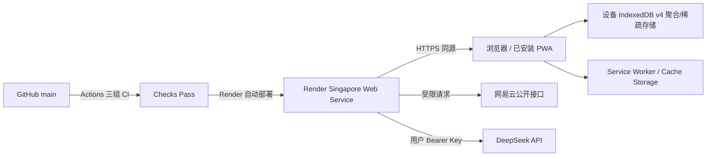

# ANISON 阶段 D：Render 固定 HTTPS 部署、发布门禁与回滚施工方案

## 1. 文档定位

本文是阶段 D 的直接施工与验收依据，用于把已经完成 A/B/C 工程施工的 ANISON 部署为不依赖开发者电脑、可由朋友通过固定 HTTPS 地址访问的 Node.js PWA Beta。

阶段 D 不重写业务功能，也不引入云端账户或业务数据库。它负责把现有生产服务、安全边界、PWA 生命周期和 CI 连接到真实托管环境，并用固定 Origin 完成发布、更新和回滚演练。

当前基线（2026-08-14）：

- 应用版本为 `1.0.0-beta.4`；首次 PR 的 Linux 性能门禁暴露大型恢复快照瓶颈后按版本策略升级。
- Node 生产入口、网易云与 DeepSeek 同源代理、安全门禁和 PWA 已完成。
- 本地自动化与 Cloudflare Quick Tunnel 临时 HTTPS 预验收通过。
- A/B/C 工作树已在施工分支形成独立基线提交 `bd647a6`，阶段 D 分支已推送并创建 PR #1；修复提交仍需通过远端 CI。
- `render.yaml`、Blueprint 契约测试、部署验证器和运行手册已在施工分支工作树完成；尚未创建 Render 服务，也没有固定公网 Origin。

## 2. 阶段目标与完成定义

### 2.1 用户侧目标

- 用户只需访问一个固定 HTTPS 地址，不依赖开发者电脑开机。
- Android Chrome、iPhone Safari 和桌面 Chrome/Edge 可以从同一 Origin 安装 ANISON。
- 本地学习数据仍只保存在各设备 IndexedDB，不上传 Render。
- 网易云歌词解析和 DeepSeek 请求通过同域 Node 服务工作。
- 免费实例冷启动、上游失败和离线状态都有明确反馈，不破坏本地学习闭环。
- 部署新版本时由 PWA 提示更新，更新和回滚不清除 IndexedDB。

### 2.2 工程侧目标

- 根目录提供可审计、可复现的 `render.yaml`。
- Render 只在 GitHub CI 全绿后部署 `main`。
- Render 使用 Node `24.14.1`、生产 Express 入口和 `/healthz` HTTP 健康检查。
- Beta 凭据只保存在 Render Secret 环境变量中，不提交到 Git。
- 固定 HTTPS 地址的版本、提交号、BUILD_ID 和实际部署提交能够互相定位。
- 完成生产冒烟、真实设备、第二版本更新和上一版本回滚演练。

### 2.3 明确不做

- 不引入 Render Postgres、Key Value、持久磁盘或云端用户账户。
- 不把歌曲、歌词、学习进度、备份或 DeepSeek Key 保存到服务器。
- 不购买自定义域名作为阶段 D 前置条件；首轮以固定 `onrender.com` 地址为 Beta canonical Origin。
- 不启用自动 PR Preview，避免额外实例费用和秘密变量缺失造成误判。
- 不使用定时探活绕过 Render Free 的休眠策略。
- 不做多区域、高可用、专用出口 IP、应用商店上架或原生安装包。

## 3. 已确认技术决策

| 项目 | 阶段 D 决策 | 原因 |
| --- | --- | --- |
| 服务类型 | Render Web Service | ANISON 包含长期运行的 Express 与两个同源 API，不能只部署为静态站点 |
| 初始实例 | `free` | 适合早期朋友 Beta；接受闲置休眠和约一分钟唤醒 |
| 区域 | `singapore` | Render 当前可选区域中更接近中国和东亚用户；区域创建后不能原地修改 |
| Canonical Origin | 首次创建的固定 `*.onrender.com` | PWA、Cache Storage 和 IndexedDB 都按 Origin 隔离，测试期不随意换域名 |
| 分支 | `main` | 与现有 GitHub Actions 和总方案一致 |
| 自动部署 | `autoDeployTrigger: checksPass` | 只有关联提交的 GitHub 检查全部通过后才部署 |
| Node 版本 | 根目录 `.node-version` 固定 `24.14.1` | 与本地、CI 和当前 Render Node 24 基线一致，避免浮动主版本 |
| 构建 | `npm ci && npm run build` | 从 lockfile 安装并生成确定性 Vite/PWA 产物 |
| 启动 | `npm start` | 启动 `server/index.js`，监听 Render 注入的 `PORT` 和 `0.0.0.0` |
| 健康检查 | `/healthz` | 只验证进程与基础服务，不请求网易云或 DeepSeek |
| CSP | 首次部署 `report-only`，公网冒烟后切换 `enforce` | 先观察真实浏览器违规，再进入强制模式 |
| Beta 门禁 | 强随机用户名和密码，Render `sync: false` | 避免公开匿名滥用上游接口 |
| DeepSeek Key | 不配置服务端 Key | 每位用户继续提供自己的 Bearer Key，服务器只受限转发 |

## 4. 目标架构与数据边界



数据边界：

- Render 文件系统是临时构建/运行环境，不承载业务持久数据。
- 歌曲、歌词、进度、收藏、复习和备份保存在用户设备 IndexedDB。
- 网易云公开歌词预览只允许现有有界内存缓存；进程重启后消失。
- DeepSeek Key、Prompt 和响应不缓存、不持久化、不写日志。
- `/healthz`、请求日志和 Render 指标只保留版本、提交、路径、状态、耗时、requestId 和错误码等元数据。

## 5. 计划交付文件

```text
render.yaml                         # Render Blueprint，服务、区域、门禁和环境变量声明
scripts/verify-deployment.mjs       # 对固定 HTTPS 地址执行只读生产冒烟
tests/render-blueprint.test.js      # Blueprint 关键字段和秘密变量约束
tests/deployment-verifier.test.js   # 部署验证器的认证、缓存、安全头和脱敏集成测试
docs/stage-d-render-deployment-plan.md
docs/deployment.md                  # 实际创建、更新、回滚和故障处理步骤
docs/testing-guide.md               # 固定 HTTPS 实机验收步骤
docs/public-release-checklist.md    # 阶段 D 发布证据
docs/public-web-pwa-construction-plan.md
docs/roadmap.md
CHANGELOG.md
```

不新增数据库配置，不新增 DeepSeek 服务端秘密，不把真实 Beta 凭据写入任何文件。

## 6. `render.yaml` 契约

计划生成的 Blueprint 形状如下，正式施工时按 Render 当前 Schema 校验：

```yaml
services:
  - type: web
    name: anison-web
    runtime: node
    plan: free
    region: singapore
    branch: main
    buildCommand: npm ci && npm run build
    startCommand: npm start
    healthCheckPath: /healthz
    autoDeployTrigger: checksPass
    maxShutdownDelaySeconds: 15
    renderSubdomainPolicy: enabled
    envVars:
      - key: NODE_ENV
        value: production
      - key: CSP_MODE
        value: report-only
      - key: BETA_AUTH_USERNAME
        sync: false
      - key: BETA_AUTH_PASSWORD
        sync: false
```

约束：

- `name` 在创建前确认可用；创建后将实际 `onrender.com` 地址记录为 Beta canonical Origin。
- 不在 Blueprint 中声明 `PORT`，由 Render 注入。
- 不在 Blueprint 中声明 DeepSeek Key、网易云 Cookie 或任何共享上游凭据。
- 不设置磁盘、数据库或多实例。
- `maxShutdownDelaySeconds: 15` 覆盖应用内部 10 秒优雅退出预算。
- `BETA_AUTH_USERNAME` 和 `BETA_AUTH_PASSWORD` 必须在首次 Blueprint 创建界面输入；更新既有 Blueprint 时，Render 不会重新提示 `sync: false` 值。
- 如果服务名、区域或 canonical Origin 要改变，必须在首批真实用户导入数据前决定。

## 7. 发布与 CI 策略

### 7.1 提交边界

当前工作树不是可部署提交。进入外部部署前按以下顺序处理：

1. 保存并审查当前 A/B/C 全部有效改动，不重置或丢弃用户工作。
2. 运行秘密扫描和 `git diff --check`。
3. 在功能分支形成可审计提交；建议把 A/B/C 基线与阶段 D 配置分成独立提交。
4. 推送分支并创建 Pull Request。
5. 等待三组 CI 全绿后合并 `main`。
6. Render 只部署已通过检查的 `main` 提交。

暂不自动执行暂存、提交、推送、建 PR 或合并；这些 Git 外部状态变更需要用户明确授权。

### 7.2 GitHub 门禁

现有 CI 三组作业均为发布必需：

- `test-and-build`：`npm ci`、147+ Node 测试、生产构建、依赖审计。
- `browser-e2e-and-performance`：核心流程、两项 v4 迁移、聚合恢复和 1000 首/80000 逻辑卡页面预算。
- `production-pwa`：生产 Service Worker、离线重启、v3→v4、waiting worker、更新锁和 IndexedDB 保留。

阶段 D 增加：

- `render.yaml` 结构与禁止硬编码秘密测试。
- 连续生产构建的 `sw.js` 摘要稳定性验证。
- 可选的手工 `npm run verify:deployment -- https://...`，不在常规 CI 请求真实网易云或 DeepSeek。

GitHub 仓库设置建议把三组 CI 设为 `main` 必需状态检查，并要求分支在合并前为最新。

### 7.3 版本策略

- 纯部署配置和文档原计划保持 `1.0.0-beta.3`；首次 PR 的 Linux 性能门禁触发应用代码修复，因此首次 Render 部署改为 `1.0.0-beta.4`。
- 构建 ID 使用 `RENDER_GIT_COMMIT`，可从设置页、`sw.js` 和 `/healthz` 对应实际提交。
- 如果阶段 D 冒烟发现需要修改应用代码，则修复版本升级为 `1.0.0-beta.4`，不得用相同版本掩盖功能修复。

## 8. 分批施工计划

### D0：冻结阶段 C 基线

施工：

- 记录用户已完成的临时 HTTPS 预验收，不把随机 Tunnel Origin 当作正式地址。
- 核对版本、manifest、BUILD_ID、IndexedDB v4 和现有未提交工作树。
- 运行 `npm ci`、`npm run check`、普通 E2E、PWA E2E 和性能门禁。
- 检查仓库中没有 `.env`、Key、Beta 密码、歌词或个人备份。

验收：本地门禁全绿，A/B/C 形成明确可提交边界。

### D1：Blueprint 与契约测试

施工：

- 新增根目录 `render.yaml`。
- 添加 Blueprint 单元测试，验证服务类型、Singapore、Node、构建/启动命令、`/healthz`、`checksPass` 和秘密占位。
- 验证没有数据库、磁盘、共享 DeepSeek Key 或明文 Beta 凭据。
- 按 Render 当前 Blueprint Schema/CLI 做一次结构校验。

验收：相同仓库可以由 Render Blueprint 创建唯一 Web Service，秘密只在控制台输入。

### D2：生产冒烟工具与文档

施工：

- 新增只读部署验证脚本，基址、Beta 用户名和密码均从命令行/环境读取。
- 检查 `/healthz`、首页、manifest、`sw.js`、图标、哈希资源、未知 API 和 Beta 401。
- 检查 HTML/manifest/SW `no-cache`、哈希资源 `immutable`、API `no-store`、MIME 与安全头。
- 脚本输出不打印密码、Cookie、Authorization、歌词或 DeepSeek Key。
- 补充 Render 创建、环境配置、更新、回滚和日志排查说明。

验收：对本地生产服务可运行；无凭据时只验证公开健康检查和 401，有凭据时完成全部只读检查。

### D3：GitHub 发布门禁收口

施工：

- 把 Blueprint 测试纳入现有 Node 测试集。
- 确认普通 E2E 阻止 SW、PWA E2E 独立允许 SW。
- 核对 `main` 的必需检查名称与 Render `checksPass` 行为。
- 确保 CI 只使用假网易云/DeepSeek 上游。

验收：失败提交不会被 Render 自动部署；三组检查全绿的提交才具备部署资格。

本地施工记录（2026-08-14）：

- D0：A/B/C 已形成提交 `bd647a6`；修复后 `npm ci`、Node 测试（141/141）、生产构建、依赖审计、核心 E2E、性能门禁和 PWA E2E 通过。
- D1：Blueprint 可由标准 YAML 解析，服务字段、Singapore/Free、`checksPass`、秘密占位和禁止持久资源约束测试通过。
- D2：验证器的无凭据、完整凭据、错误凭据、缓存、安全头、版本元数据和脱敏路径通过本地生产服务集成测试。
- 连续两次生产构建的 `sw.js` SHA-256 均为 `D28FBA6F43E54780A221173227F449DEA8508269D35279E8C34F49FD7A0C1F87`。
- D3：施工分支已推送并创建 PR #1；修复后的 Linux CI 仍需全绿，并让 `main` 三项必需检查实际生效。
- PR #1 首次 CI 中 `test-and-build` 与 `production-pwa` 通过；Linux 大数据作业在恢复阶段超过 5 分钟超时。修复将逐条 Cursor 快照替换为每批 2000 条的 `getAll`/`getAllKeys` 原生分页，新增 4101 个复合主键跨批恢复测试，并把迁移与恢复指标分开输出；原 30 秒/10 秒预算不放宽。
- PR #1 后续 CI 证明分页修复把恢复压入预算，但旧 v3 逐卡物理模型的 80,000 卡迁移仍耗时 217,499 ms。提交 `5a76193` 以 IndexedDB v4 取代该路径：每曲一条内容文档、默认状态不落盘、索引延后创建，并在单个 `versionchange` 事务内归档、写入和验证。
- 2026-08-15 Windows 强制执行完整门禁：全默认迁移约 8.2 秒（80,000 逻辑单元、0 状态），10% 状态迁移约 13.3 秒（8,000 状态），聚合恢复约 6.2～6.6 秒；147/147 Node 测试和 v3→v4 PWA 更新用例通过。Linux CI 仍须在推送后给出正式发布证据。

### D4：创建 Render 服务（需要用户授权）

外部操作：

1. 用户登录 Render 并授权访问 `riiiveeer/ANISON`。
2. 通过仓库根目录 `render.yaml` 创建 Blueprint。
3. 确认服务名、Singapore、Free、`main` 和 `checksPass`。
4. 在 Render 表单中输入强随机 Beta 用户名和密码。
5. 不添加 DeepSeek Key、数据库或磁盘。
6. 等待首次构建、健康检查和部署完成。
7. 记录服务 ID、固定 HTTPS 地址、部署提交和部署时间；不把秘密写入仓库。

验收：关闭开发者电脑后，固定 HTTPS `/healthz` 仍返回 `1.0.0-beta.4` 与正确提交号。

### D5：固定 HTTPS 生产冒烟

自动/桌面检查：

- `/healthz` 未认证返回 200，首页未认证返回 401。
- 输入 Beta 凭据后首页、路由、manifest、SW、图标和哈希资源均正常。
- `/api/not-found` 返回 JSON 404，不回退 HTML。
- HTTPS、HSTS、CSP Report-Only、frame、nosniff、Permissions-Policy 等响应头存在。
- 首次访问和 Free 冷启动有记录；不通过外部定时请求阻止休眠。
- Render 日志只有允许的元数据，未出现凭据、歌词、Prompt 或 Key。

真实上游检查：

- 使用一首公开单曲完成一次网易云预览和确认导入。
- 用户自愿提供个人 DeepSeek Key，发起一次最小讲解请求。
- 分别观察成功、错误提示、超时和恢复；不在截图或日志保存 Key/歌词全文。

### D6：固定 Origin 实机与更新验收

平台矩阵：

| 平台 | 必测项目 |
| --- | --- |
| Android Chrome | 安装、maskable 图标、standalone、WiFi/移动网络、飞行模式冷启动、后台恢复 |
| iPhone Safari | 添加到主屏幕、Apple 图标、安全区、软键盘、离线重开、恢复在线 |
| Windows Chrome/Edge | 安装、独立窗口、缩放、检查更新、更新后单次刷新 |

流程：

1. 在 canonical Origin 新建测试数据并导出备份。
2. 记录歌曲数、学习进度、收藏、评分、版本和 BUILD_ID。
3. 断网冷启动，验证所有本地功能和联网功能降级。
4. 部署第二个不同且同样兼容 IndexedDB v4 的 BUILD_ID；先“稍后”，再“立即更新”。
5. 在大型恢复/导入操作期间确认更新按钮被关键操作锁阻止。
6. 更新后核对 IndexedDB 数据、备份和已显示讲解。
7. WiFi 与移动网络各完成一次核心冒烟，记录中国大陆网络差异。

注意：临时 Tunnel、localhost 和 Render 是不同 Origin，旧测试数据不会自动迁移。需要时从仍可访问的旧 Origin 导出，再在 Render Origin 恢复。

### D7：CSP Enforce 与安全收口

施工：

- 在 Report-Only 环境完成全部核心路由、网易云封面、AI、安装和更新检查。
- 浏览器控制台和 Render 日志无新的真实 CSP 违规后，把 `CSP_MODE` 改为 `enforce` 并重新部署。
- 再跑首页、导入、学习、设置、PWA、API 和部署冒烟。
- 轮换临时 Beta 密码，确认旧会话在服务重启后失效。

验收：CSP 强制模式下核心流程正常，未放宽为通配来源。

### D8：回滚演练与文档收口

施工：

1. 在 Render Deploys 选择前一个成功构建执行 Dashboard Rollback。
   目标必须包含 IndexedDB v4 支持；禁止选择只会打开 v3 的部署。
2. 确认回滚后 `/healthz`、版本/提交、首页和两条 API 边界正常。
3. 确认 PWA 获取回滚 worker，缓存只清理 ANISON 两类缓存。
4. 确认 IndexedDB、localStorage 和业务数据未删除。
5. 确认 Dashboard 回滚后 Auto Deploy 已暂停；修复完成再人工恢复。
6. 记录回滚目标、开始/结束时间、验证结果和恢复自动部署的负责人。
7. 更新 README、部署、测试、安全、隐私、路线图、总方案、清单和 CHANGELOG。

验收：能在不依赖开发者电脑和不清除用户数据的情况下部署、更新、失败回滚并恢复发布。

## 9. 生产验收矩阵

| 类别 | 验收项 | 通过标准 |
| --- | --- | --- |
| 独立性 | 开发电脑关闭 | 固定 HTTPS 仍可访问和唤醒 |
| 健康 | `/healthz` | 5 秒内返回 2xx；版本和提交正确 |
| 部署门禁 | CI 失败提交 | 不进入 Render 部署 |
| 鉴权 | 未认证首页/API | 稳定 401；`/healthz` 例外 |
| 静态缓存 | HTML/manifest/SW | `no-cache` |
| 哈希资源 | JS/CSS | `immutable` |
| API | 未知/401/429/5xx | 不返回 App Shell HTML |
| 安全头 | HTTPS 响应 | HSTS、CSP、frame、nosniff 等符合契约 |
| 日志 | 请求和错误 | 无 Key、Cookie、Authorization、歌词、Prompt、IP 原文 |
| PWA | 安装/离线/更新 | 固定 Origin 完整闭环，数据保留 |
| 上游 | 网易云/DeepSeek | 成功与失败均可恢复，不影响本地学习 |
| 冷启动 | Free 休眠后首次访问 | 有清晰等待预期，唤醒后功能恢复 |
| 回滚 | 前一成功部署 | 服务恢复、SW 更新、IndexedDB 不变 |

## 10. 监控与运行记录

阶段 D 使用 Render 内置日志、部署记录和指标，不接入会采集用户内容的第三方 SDK。

每日/每次测试记录：

- `/healthz` 可用性和冷启动时间。
- 部署提交、BUILD_ID、部署耗时和健康检查结果。
- HTTP 4xx、429、5xx 数量与错误码分布。
- 网易云超时、队列繁忙和 DeepSeek 上游错误。
- Android/iPhone 的网络类型、浏览器版本和阻断问题。

禁止记录：

- 完整歌词、Prompt、DeepSeek Key、Authorization、Cookie、Beta 密码。
- 完整网易云分享文本、备份文件和可识别个人身份的原始 IP。

Free 服务闲置 15 分钟后休眠属于预期行为。若阶段 E 朋友测试因冷启动频繁受阻，再评估付费实例；不通过定时探活规避平台限制。

## 11. 故障与回滚决策

| 故障 | 第一动作 | 后续处理 |
| --- | --- | --- |
| 构建失败 | 保持上一部署，不手工绕过 CI | 修复分支、重跑门禁 |
| 新实例健康失败 | 让 Render 保持旧实例 | 查启动日志、Node/环境变量和 `dist` |
| Beta 401 | 检查两项凭据是否成对配置 | 轮换凭据并重新部署 |
| API 403 | 检查代理 Host、HTTPS 协议和同源头 | 不放宽为 `*` CORS |
| 网易云不可用 | 保持本地 LRC 和学习功能 | 查看固定错误码，必要时临时降级入口 |
| DeepSeek 不可用 | 明确提示用户稍后重试 | 不改为服务器共享 Key |
| CSP 阻断 | 临时回到已验证 Report-Only 部署 | 精确修复来源，不加入通配符 |
| SW 导致页面故障 | 回滚前一构建或发布 pass-through worker | 只清 ANISON Cache，不动 IndexedDB |
| 域名变更 | 先导出旧 Origin 数据 | 在新 Origin 恢复并重新安装 PWA |

## 12. 风险与升级触发条件

| 风险 | 当前缓解 | 升级触发条件 |
| --- | --- | --- |
| Free 冷启动约一分钟 | 应用提示、测试说明、接受 Beta 限制 | 朋友测试持续反馈无法接受时升级实例 |
| Free 实例/文件系统重启 | 业务数据全部在客户端，服务器无持久业务状态 | 只有未来引入账号/云同步时才设计数据库 |
| 中国大陆访问波动 | Singapore、WiFi/移动网络双测、本地离线闭环 | 持续不可用时重新评估地区和国内合规托管 |
| 网易云出口 IP/频率风险 | 小规模 Beta、全局并发 2、有界缓存和限流 | 出口被限制时暂停功能并评估合规数据源 |
| `onrender.com` 后续换域名 | 首轮明确 canonical Origin、持续提供备份 | 正式用户扩大前决定是否使用自有域名 |
| 免费回滚仅保留有限历史 | 每次发布留 Git tag、Release 和验收记录 | 需要更长回滚窗口时升级计划或保存构建制品 |

## 13. 完成清单

- [x] 当前 A/B/C 工作树形成无秘密、可审计提交（`bd647a6`）。
- [x] `render.yaml` 与 Blueprint 契约测试完成。
- [x] 部署冒烟脚本和运行手册完成。
- [ ] GitHub 三组 CI 全绿且 `main` 必需检查生效。
- [ ] Render Singapore Web Service 创建，Beta Secrets 配置完成。
- [ ] 固定 HTTPS 地址、`/healthz`、版本和提交对应正确。
- [ ] 未认证 401、缓存头、MIME、安全头、API Network Only 验收通过。
- [ ] 网易云与 DeepSeek 各完成一次真实但最小的公网请求。
- [ ] Android、iPhone 和桌面固定 Origin 安装/离线记录完成。
- [ ] 第二版 worker 更新、关键操作锁和 IndexedDB 保留通过。
- [ ] CSP 从 Report-Only 安全切换到 Enforce。
- [ ] Render Dashboard 回滚演练和 SW 数据保留通过。
- [ ] README、部署、测试、隐私、安全、路线图、总方案和 CHANGELOG 最终收口（本地说明已更新，等待填入公网证据）。

## 14. 外部授权边界

以下动作不因本施工方案自动获得授权：

- 暂存、提交、推送当前工作树。
- 创建或合并 GitHub Pull Request。
- 修改 GitHub branch protection 或仓库 Secrets。
- 授权 Render 访问 GitHub。
- 创建、更新、删除 Render 服务或产生费用。
- 输入、轮换 Beta 凭据。
- 切换 CSP Enforce、绑定自定义域名或升级付费实例。

执行到对应批次时，必须展示当前验证证据、准确目标和影响，再由用户明确确认。

## 15. 建议工期

| 批次 | 内容 | 预计有效时间 |
| --- | --- | --- |
| D0～D2 | 基线冻结、Blueprint、测试和运行手册 | 0.5～1 天 |
| D3～D4 | GitHub 门禁、首次 Render 创建与部署 | 0.5 天 |
| D5～D7 | 公网、上游、实机、更新和 CSP 验收 | 0.5～1 天 |
| D8 | 回滚演练与文档收口 | 0.5 天 |

合计约 2～3 个有效开发日，主要不确定性来自 Render/GitHub 外部授权、中国大陆网络质量、iPhone/Android 设备可用性和真实上游波动。

## 16. 官方参考

- [Render Blueprint YAML Reference](https://render.com/docs/blueprint-spec)
- [Render Web Services](https://render.com/docs/web-services)
- [Render Regions](https://render.com/docs/regions)
- [Render Health Checks](https://render.com/docs/health-checks)
- [Render Deploys and Zero-Downtime Deploys](https://render.com/docs/deploys)
- [Render Rollbacks](https://render.com/docs/rollbacks)
- [Render Free Web Service Limits](https://render.com/docs/free)
- [Render Node.js Version](https://render.com/docs/node-version)
- [Render Environment Variables and Secrets](https://render.com/docs/configure-environment-variables)
- [Render Custom Domains](https://render.com/docs/custom-domains)
